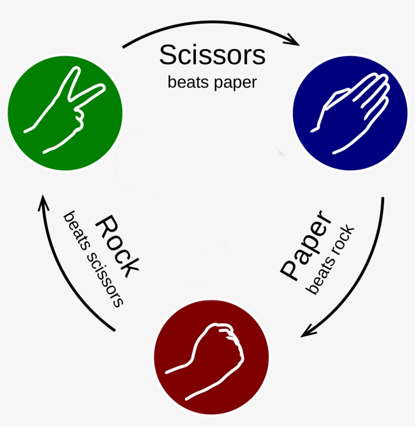

# Rock Paper Scissors
This code base allows a player to play a best of X games against the computer. 
The game is PG-13 as there are some sarcastic print statements the computer may share throughout the game! 

# How to play
Simply run the code and follow the console instructions!  
First you will need to provide the number of games you would like to play 
And then make your choice every round!

# Rules of the game
Rules of the game can be found under: https://en.wikipedia.org/wiki/Rock_paper_scissors  
TL;DR Version: You take rounds picking one of the 3 options (Rock Paper Scissor) 
With the following diagram depicting the rules of the winner:

